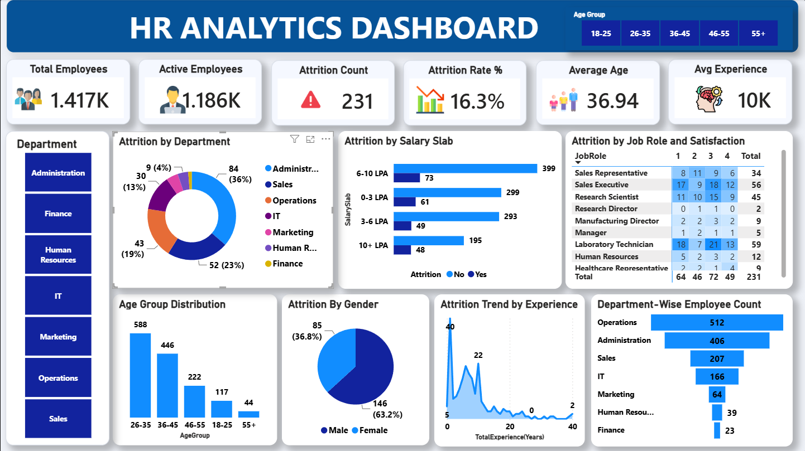

# HR Analytics Dashboard

An interactive HR Analytics Dashboard built with Microsoft Power BI to analyze employee attrition, workforce demographics, salary distribution, job satisfaction, and departmental trends.



---

## Project Overview

This project analyzes employee data to identify workforce trends and patterns related to employee attrition.

The dashboard transforms raw HR data into interactive visualizations and key performance indicators (KPIs) that provide insights into:

- Employee headcount
- Active employees
- Employee attrition
- Attrition rate
- Department distribution
- Salary slab distribution
- Job satisfaction
- Employee demographics
- Gender distribution
- Employee experience

The goal of this project is to demonstrate how data analytics and visualization can be used to support data-driven HR decision-making.

---

## Dashboard Preview

The dashboard provides an interactive overview of key HR metrics and allows users to explore employee data using filters.

### Key Performance Indicators

- Total Employees
- Active Employees
- Attrition Count
- Attrition Rate
- Average Age
- Average Experience

### Interactive Filters

The dashboard can be filtered by:

- Age Group
- Department

All visualizations update dynamically based on the selected filters.

---

## Key Insights

Based on the current analysis:

- The dataset contains **117 employees**.
- **73 employees** are currently active.
- **44 employees** are classified as having left the organization.
- The overall attrition rate is **37.6%**.
- The Administration department contains the largest number of employees.
- Employee attrition varies across different salary slabs.
- Job satisfaction levels differ across job roles.
- Employee attrition can be analyzed across gender, age groups, and experience levels.

> The results may change when different filters are applied to the dashboard.

---

## Dashboard Visualizations

### Attrition by Department

Analyzes the distribution of employee attrition across different departments.

### Attrition by Salary Slab

Compares employees who stayed and left across different salary ranges.

### Attrition by Job Role and Satisfaction

Analyzes job satisfaction levels across different job roles and provides insights into potential relationships between satisfaction and employee attrition.

### Age Group Distribution

Shows the distribution of employees across different age groups.

### Attrition by Gender

Compares employee attrition across gender groups.

### Attrition Trend by Experience

Analyzes employee attrition across different levels of work experience.

### Department-Wise Employee Count

Shows the number of employees within each department.

---

## Data Analysis Process

### 1. Data Preparation

The HR dataset was reviewed and prepared for analysis.

The preparation process included:

- Reviewing the dataset structure
- Checking data types
- Identifying relevant fields
- Reviewing categorical and numerical variables

### 2. Data Cleaning and Transformation

The dataset was transformed to support dashboard analysis.

This included:

- Checking for missing values
- Standardizing categorical data
- Creating age group categories
- Creating salary slab categories
- Preparing fields for analysis and visualization

### 3. Data Modeling

The data was structured to analyze relationships between:

- Employee demographics
- Department
- Job role
- Salary
- Job satisfaction
- Work experience
- Attrition

### 4. Dashboard Development

The dashboard was developed using:

- KPI cards
- Bar charts
- Donut charts
- Area charts
- Matrix tables
- Interactive filters

---

## Key Metrics

### Total Employees

The total number of employees included in the dataset.

### Active Employees

The number of employees who remain active in the organization.

### Attrition Count

The number of employees who have left the organization.

### Attrition Rate

The percentage of employees who have left the organization compared to the total number of employees.

```text
Attrition Rate = Attrition Count / Total Employees
